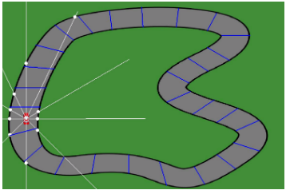
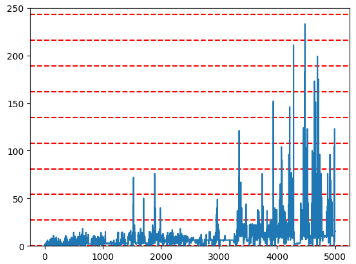

# Pydrive: Reinforcement Learning for 2D Car Game Navigation

## INTRODUCTION
Reinforcement Learning (RL) has emerged as a powerful technique for training intelligent agents in complex and dynamic environments. Its successful applications span various domains, from robotics to gaming. This project focuses on applying RL to a 2D car game navigation task.

The goal is to develop an autonomous car agent capable of navigating a track and completing full laps without human intervention. To accomplish this, the Pygame library, a versatile tool for creating
2D games in Python is utilized. Pygame provides a suitable framework to construct an interactive and visually engaging car game environment.

To train the car agent, deep Q-learning, a variant of Q-learning that utilizes deep neural networks to approximate Q-values is employed. This enables the agent to learn an optimal policy by iteratively improving its decision-making process based on rewards and penalties obtained during gameplay. Through exploration of the game environment and adaptive action selection, the agent gradu-
ally acquires the ability to make informed decisions and achieve successful navigation on the track.

## IMPLEMENTATION
The implementation of the Pydrive project is divided into three main parts: the Game, the Agent, and the Model. Each part plays a crucial role in the overall functionality of the system.

### Game
The Game component in Pydrive creates a 2D car game environment using Pygame. It includes a challenging track layout and a controllable car. It handles user inputs, updates the game state, and renders the graphics.

#### Features
To effectively model the probabilistic future space and train the model to drive the car around the track, a strong rep- resentation of the current state is essential. This is achieved by incorporating two key features:

* **Sensors**: 10 sensors around the car, capturing the distance from the car and the edge of the track.
* **Checkpoints**: 27 total checkpoints placed around the track.

#### Reward system
The reward system in the game is designed with the following structure:

* Clearing a checkpoint $\rightarrow$ **+10**
* Collision with the edge of the track $\rightarrow$ **-20**
* Backward or stale movement (speed $\leq$ 0) $\rightarrow$ **-0.2**
* Forward movement (speed > 0) $\rightarrow$ **+0.1**

These rewards incentivize the car to successfully navigate the track, penalize collisions, and encourage forward progress. The rewards based on car movement promote efficient learning by prioritizing forward motion.

### Agent
The Agent component serves as the autonomous car agent in the system, utilizing reinforcement learning for track navigation. It interacts with the game environment, receives state observations, and selects actions based on its learned policy. The agent’s objective is to maximize cumulative rewards by making actions that lead to successful laps. This decision-making process relies on the deep Q-learning algorithm, which combines a deep neural network as a function approximator with the Q-learning update rule. Additionally, the Agent component employs an epsilon-greedy policy to balance exploration and exploitation.

The state representation consists of 16 normalized values obtained after each step, including the current position (x, y), car speed, car angle (0 - 360), 10 sensor distances, reward, and a boolean "done" flag. Action selection can be either random or based on the model’s prediction. Initially, a high epsilon value of 0.9 promotes exploration, gradually decaying by a factor of 0.99 after each episode until reaching a minimum of 0.01. This ensures ongoing exploration even as the model learns the optimal path.

Four possible actions are available to the agent: forward, backward, left, and right, represented by the action vectors [1, 0, 0, 0], [0, 1, 0, 0], [0, 0, 1, 0], and [0, 0, 0, 1] respectively.

### Model
The Model component refers to the deep neural network model used in the deep Q-learning algorithm. The model takes the current state of the game as input and outputs Q-values for all possible actions. The architecture of the model typically consists of an input layer of size 14 (representing the current state values), one hidden layer of size 256 and an output layer of size 4 (representing the action state). The model is trained using a mean squared error loss function, and Adam optimizer with 0.001 learning rate. During the training process, the model learns to approximate the Q-values that maximize the expected cumulative reward for each state-action pair.

#### Training
The training process consists of two parts: short memory training and long memory training. In short memory training, the model is trained with each step of the game, using only the current state. In long memory training, the model is trained after the car collides with the edge, activating the long memory and resetting the game. The long memory training utilizes a memory buffer that can store up to 100,000 instances of past states.

In the training step, the initial prediction values and target values are set to the model’s predictions. Then, the target values are updated using the Bellman equation. If the boolean value "done" is true, the target value $Q_{new}$ is set to the reward of the current state. If "done" is false, the target value $Q_{new}$ is computed using the formula:

$$ Q_{new} = Reward\ +\ \gamma\ \cdot\ max(model.predict(state_{next})) $$

where $\gamma$ is the discount factor, initialized to 0.9.

Finally, the optimizer’s gradients are zeroed, the loss is calculated between the target values and the predicted values, and the gradients are backpropagated to update the model’s parameters. 

## RESULTS
During the training process, the model gradually learned to move forward and navigate checkpoints while avoiding track edges. The training progress is depicted in the figure below over 5,000 episodes, with red dotted lines representing a full lap around the track.

At around 1,500 episodes, the model achieved its first full lap. However, there was a temporary decline in performance. After an additional 2,000 episodes, the model’s performance exponentially increased, reaching up to 8 full laps with a randomness factor of 1%. The final model, selected from the last few episodes, consistently completed full laps during the testing stage. Additional tracks were created to evaluate the model’s capabilities, with three tracks cleared successfully. One track presented a new type of turn that the model failed to navigate.

The figure above displays the newly created testing tracks, highlighting the model’s performance on each track. The car struggled to complete the first track due to the steep turn, while surprisingly, it successfully completed a full lap on the fourth track despite being disconnected.

## CONCLUSION
The trained Deep Q-Network agent has demonstrated remarkable learning capabilities by successfully completing full laps around the track. Even more, completing full laps on never before seen tracks.
This achievement showcases the potential of reinforcement learning algorithms in tackling challenging tasks such as autonomous driving. Future work could focus on further improving the model’s performance, fine-tuning hyperparameters, or extending the approach to more complex environments.

https://github.com/R4d0slav/Artificial-Intelligence/assets/60989050/3b586d44-12f6-4f40-b09d-d17b502a961c

